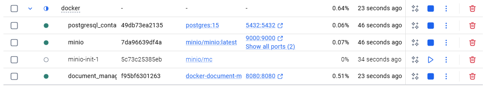
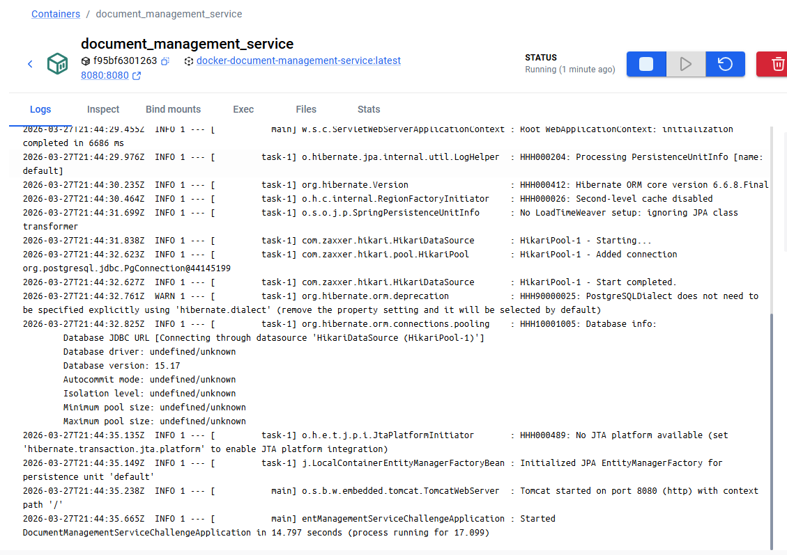
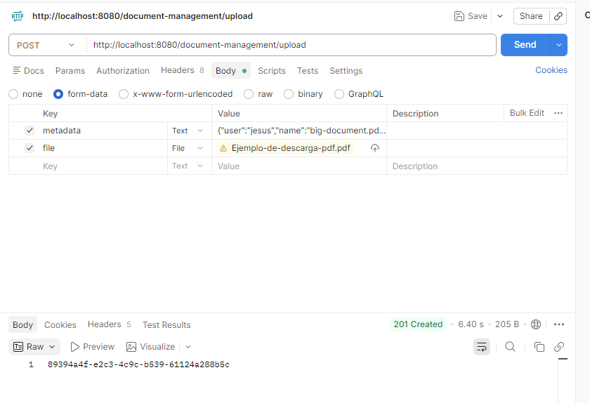
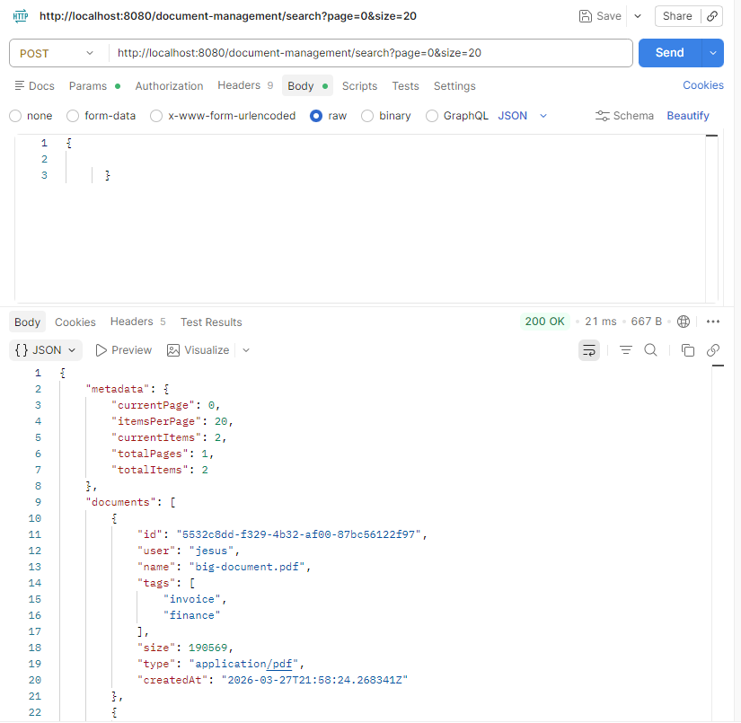
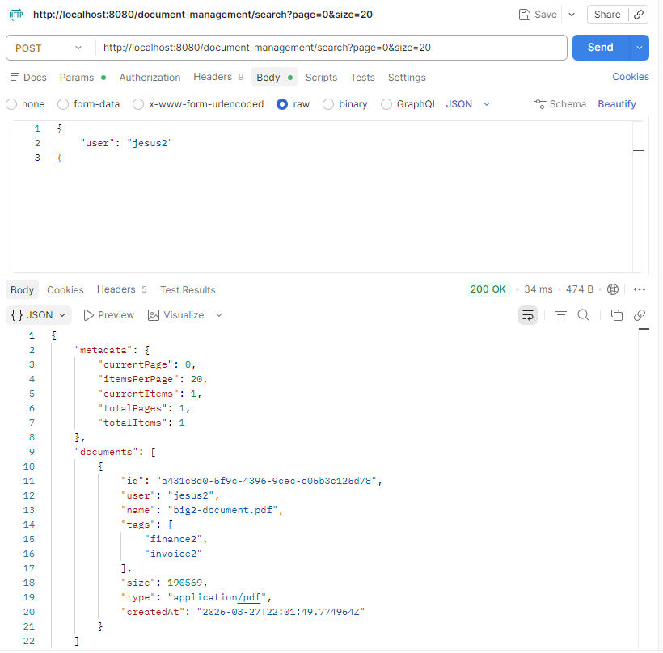
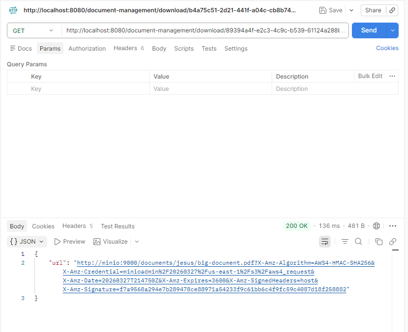
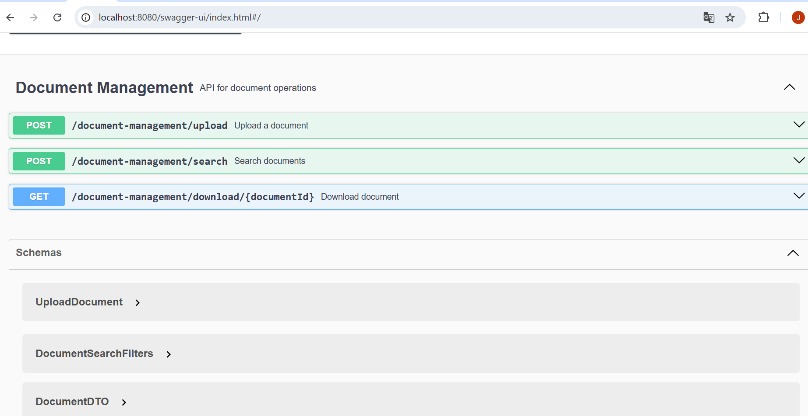
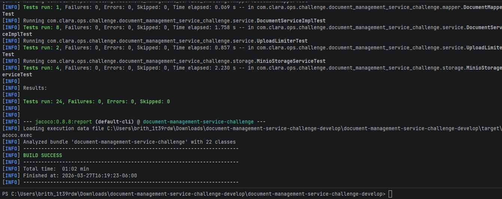
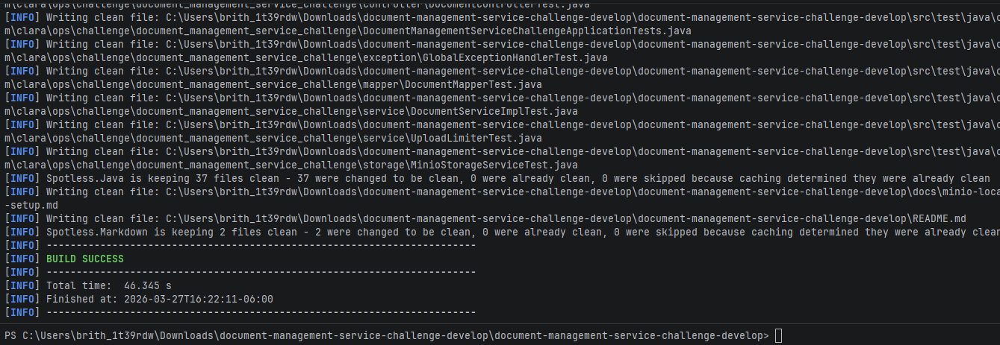

# Document Management Service Challenge

This project is a Document Management Service built with Spring Boot 3, using MinIO for file storage, PostgreSQL for persistence, and unit/integration tests with JUnit 5 and Mockito.

## Features

- Upload PDF documents (maximum size 500MB)
- Download documents using pre-signed URLs from MinIO
- Search documents by user, name, or tags
- File validation and concurrent upload limits
- Persistence in PostgreSQL using JPA/Hibernate
- Test coverage with Jacoco

## Requirements

- Java 17 (OpenJDK or Oracle JDK)
- Maven 3.9+
- Docker (optional, for MinIO and PostgreSQL)
- MinIO for file storage
- PostgreSQL for data persistence

## Installation

1. Clone the repository:

   git clone https://github.com/JesusTM/document-management-service-challenge.git
   cd document-management-service-challenge

2. Build the project with Maven

   ./mvnw clean package -DskipTests

## API Endpoints

| Method |              Endpoint              |      Description      |
|--------|------------------------------------|-----------------------|
| POST   | /document-management/upload        | Upload a PDF document |
| GET    | /document-management/download/{id} | Get a download URL    |
| POST   | /document-management/search        | Search documents      |

Full API documentation is available via Swagger.

## Swagger

Swagger UI is available at:

http://localhost:8080/swagger-ui.html

From here you can test all endpoints and see the model documentation (UploadDocument, DocumentDTO, etc.).

## Notes

- File upload limit is 500MB.
- Only valid PDF files are accepted.
- MinIO bucket is configurable via minio.bucket.
- For testing, using H2 database and a local MinIO bucket is recommended.

## Evidence

### API UP




### Upload Document

```
curl --location 'http://localhost:8080/document-management/upload' \
--form 'metadata="{\"user\":\"jesus\",\"name\":\"big-document.pdf\",\"tags\":[\"finance\",\"invoice\"]}";type=application/json' \
--form 'file=@"/C:/Users/brith_1t39rdw/Downloads/Ejemplo-de-descarga-pdf.pdf"'
```



### Search All Document

```
curl --location 'http://localhost:8080/document-management/search?page=0&size=20' \
--header 'Content-Type: application/json' \
--data '{}'
```



#### Search Specific Document

```
curl --location 'http://localhost:8080/document-management/search?page=0&size=20' \
--header 'Content-Type: application/json' \
--data '{
    "user": "jesus2"
}'
```



### Download Document

```
curl --location 'http://localhost:8080/document-management/download/89394a4f-e2c3-4c9c-b539-61124a288b5c'
```



### Swagger

http://localhost:8080/swagger-ui/index.html#/


### Code Coverage

Run tests and generate coverage report with ./mvnw clean test jacoco:report


Run the spotless add-on to ident the application ./mvnw spotless:apply



## Justification for Deviation on File Size Restriction and Lightweight Version

During the implementation of the document management API, an attempt was made to enforce a maximum upload size of 50MB at the application level. However, when deploying the API in a Docker environment, this configuration caused the container to fail at startup due to JVM memory and Tomcat limitations related to large file handling.

To address this issue, a lightweight version of the solution was generated (branch - feature/jdbc-solution), aiming to reduce memory footprint and simplify the deployment. Despite these efforts, the lightweight version also failed to start properly, indicating that the problem is rooted in the container environment and resource allocation rather than in the application code itself.

### Reason for Deviation:

- The file size restriction could not be enforced because the Docker environment could not support the required memory and Tomcat configurations for handling large uploads.
- Generating a lightweight version was an attempt to mitigate resource constraints; however, the core issue persisted, confirming that deployment environment limitations, not application logic, were the primary barrier.
- As a result, the 50MB upload restriction was deferred, prioritizing API stability and container startup over strict enforcement of the upload size at this stage.

This deviation ensures that the application remains deployable and testable while acknowledging the limitation, which can be addressed in future iterations by adjusting container resources, JVM options, or using external storage services capable of handling larger files.